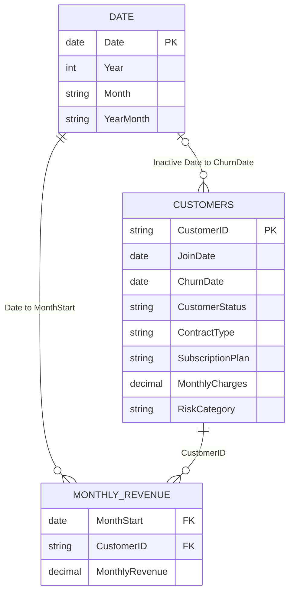

# Phase 4: Data Modeling

| Item | Definition |
|---|---|
| Business objective | Build a simple model that supports correct customer and time analysis |
| Analysis approach | Use Customers as the customer dimension, Monthly Revenue as the fact table, and a dedicated Date table |
| Business value | Produces reliable filtering, reusable measures, and better report performance |
| Expected insight | Customer attributes explain churn while the revenue fact table explains financial trends over time |

## Recommended Model

## Relationships

| From | To | Cardinality | Cross-filter | Status |
|---|---|---|---|---|
| Customers[CustomerID] | Monthly Revenue[CustomerID] | One-to-many | Single | Active |
| Date[Date] | Monthly Revenue[MonthStart] | One-to-many | Single | Active |
| Date[Date] | Customers[ChurnDate] | One-to-many | Single | Inactive |

The inactive churn-date relationship is activated only inside churn trend measures with `USERELATIONSHIP`.

## Why This Model Works

- The customer table contains one unique row per customer.
- The revenue table can grow without duplicating customer attributes.
- The Date table provides consistent month, quarter, and year filtering.
- Single-direction relationships reduce ambiguity.
- Measures are stored centrally instead of repeated inside visuals.

## Model Optimization

- Mark Date as the official date table.
- Sort `Date[Month]` by `Date[Month No]`.
- Sort `Date[Year Month]` by `Date[Year Month Sort]`.
- Hide technical keys and sort columns from report view.
- Use a dedicated Measures table.
- Disable Auto date/time in the Power BI file options.
- Avoid calculated columns when a Power Query column or measure is more appropriate.
- Keep the model to these three tables for this portfolio version.

